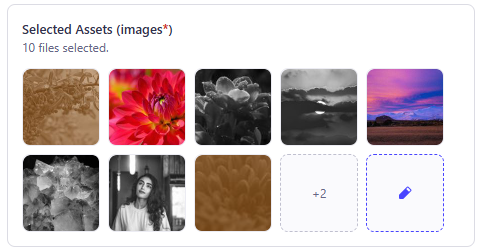

[](https://www.npmjs.com/package/strapi-enhanced-file-browser) 
[](https://npmjs.com/package/strapi-enhanced-file-browser)

# Strapi Enhanced File Browser 

Adds improved drag-and-drop functionality to the file browser input field, providing a faster and more user-friendly UX.

The main problem this plugin solves is that Strapi’s native file browser is slow when using drag and drop, which causes issues when handling a large number of files — for example, when working with an image gallery containing many images.

This plugin solves the problem by using the dnd-kit library to provide a highly optimized experience.

## Installation

Add the package to your Strapi application:

```bash
npm i strapi-enhanced-file-browser
```

## Usage

Just install and you're good to go. Next Time you use a media/file input on a new collection/single type it will show.

## Screenshots



