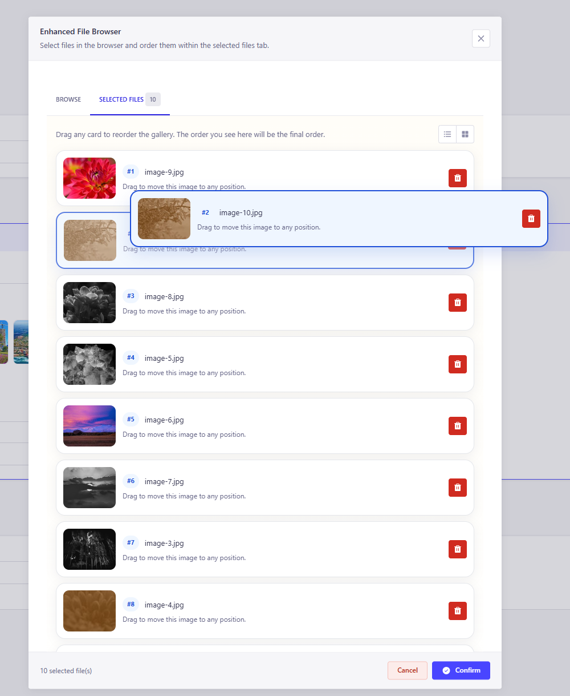

# Strapi Enhanced File Browser

Adds better Drag&Drop functionality to the file browser input and a fastest and more friendly UX.

The main problem this plugin solves is strapi native file browser being slow on Drag&Drop creating problems when handling with a lot of files to select, for example when working with an image gallery with several images.

This plugin solves the problem using d&dkit library to have a very optimized experience.

## Usage

Just install and you're good to go. Next Time you use a media/file input on a new collection/single type it will show.

## Screenshots

